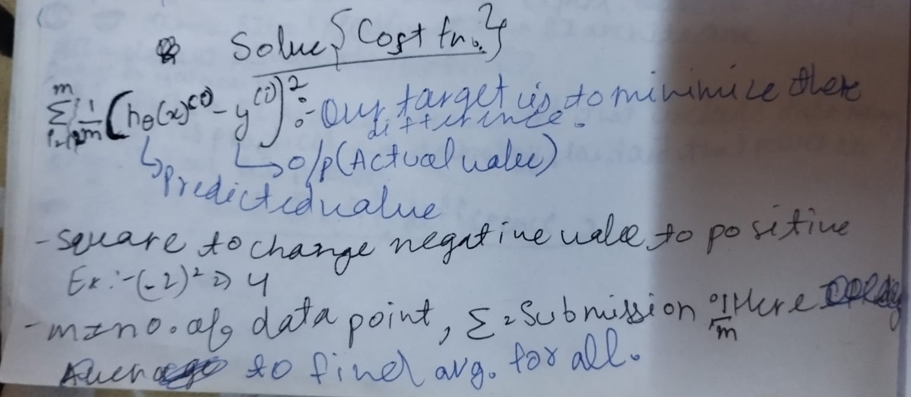
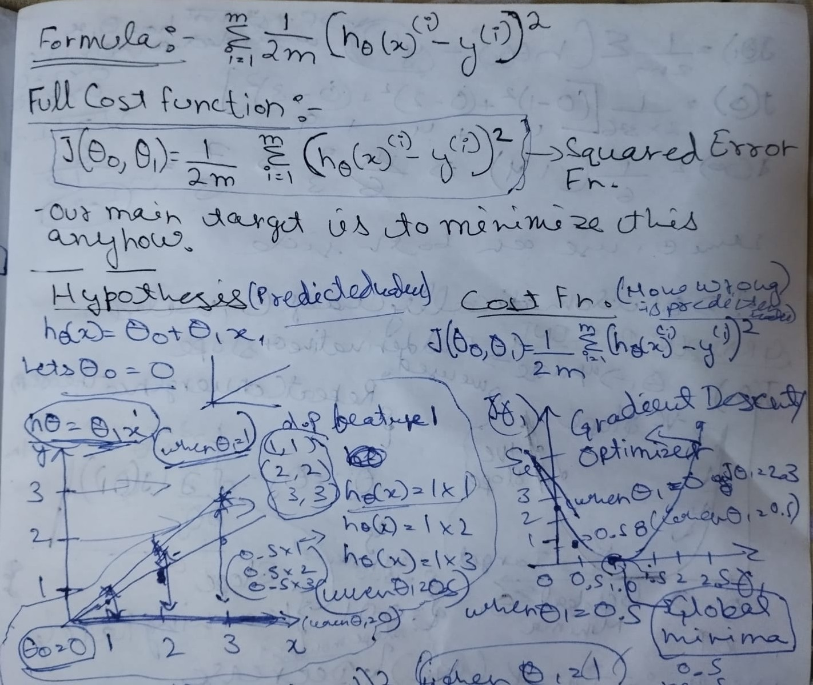
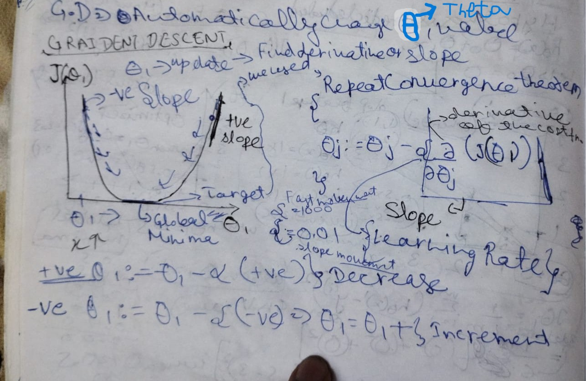
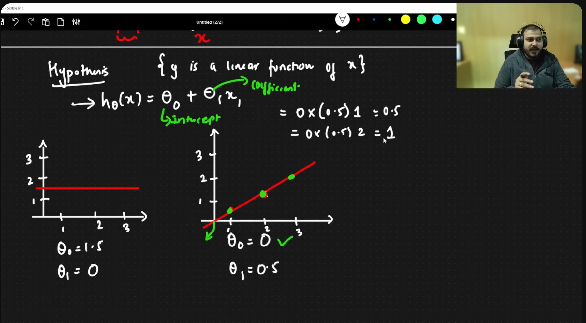
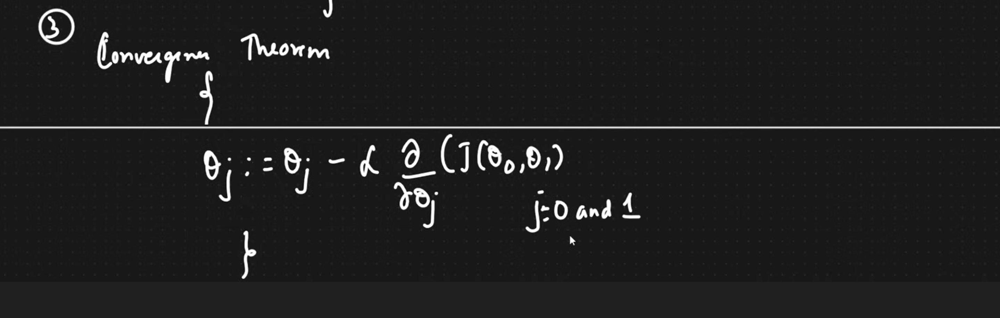

#### Date: 17 June 2026

# Link
[video 2](https://youtu.be/jerPVDaHbEA?si=TAXziV6KKwl9sJYQ)

# Simple Linear Regression

**Linear Regression Machine Learning aur Data Science ka ek basic aur important algorithm hai. Ye usually ML ka pehla topic hota hai.**

**Hypothesis** ka Hindi meaning:  
- Parikalpana (परिकल्पना)  
- Anuman (अनुमान)

---

# Agenda

1. What problem are we solving  
2. Geometric Intuition  
   - Diagram/Figure ke through samjhenge ki hum kya solve kar rahe hain  
3. Mathematical Intuition  

> **Note:** Isi structure ko follow karke baaki ML algorithms bhi samajhni chahiye.

---

# First Problem

Machine Learning mainly 2 types ki hoti hai:

## 1. Supervised Learning

- **Regression** → Continuous values predict karta hai  
- **Classification** → Categories predict karta hai  

## 2. Unsupervised Learning

---

# Linear Regression

Linear Regression ko multiple ways se solve kar sakte hain:

- Excel Sheets se  
- Statistics ke point of view se  
- Mathematical equations ke through  

Math se concept sabse achhe se samajh aata hai.

---

# What Problem Are We Solving?

Example: Humare paas 2 features hain:

- **Weight (kg)** → X-axis → Independent Feature (Input)  
- **Height (cm)** → Y-axis → Dependent Feature (Output)

### Goal

Hum X (input) ki value denge aur model Y (output) predict karega.

Example:

```text
Weight = Input
Height = Predicted Output
```

### Process

- Hum model ko training data dete hain  
- Model data se patterns learn karta hai  
- Model ek mathematical relationship banata hai  
- Is relationship ko **Hypothesis** kehte hain  

Hypothesis ka kaam:

- Weight lena (Input)  
- Height predict karna (Output)

---

# Main Aim

Humara main aim ek **Best Fit Line** create karna hai.

Best Fit Line woh line hoti hai jisme:

- Actual values aur predicted values ke beech ka difference minimum ho  
- Overall prediction error minimum ho  

---
## Linear Regression start

<b><u>_image1_</u>:- Linear Regreesion Terminology</b>  
  


# Residual Error

**Residual Error = Difference between Actual Value and Predicted Value**

Formula:

```text
Residual Error = Actual Value - Predicted Value
```

Where:

- **Actual Value** → Original data point  
- **Predicted Value** → Best fit line par jo value milti hai  

Example:

```text
Actual Height = 170 cm
Predicted Height = 168 cm

Residual Error = 170 - 168 = 2
```

---

# Important Concept

Hum sabhi residual errors ka **total error** calculate karte hain.

Jis line ka total error sabse minimum hota hai, wahi **Best Fit Line** hoti hai.

> “Submission of Error” incorrect term hai.  
> Correct term = **Sum of Errors** or **Total Error**

---

# Steps

1. Training data provide kiya jata hai  
2. Model ko train kiya jata hai  
3. Model ek hypothesis function banata hai  
4. Input diya jata hai  
5. Output predict hota hai  

Example:

```text
Input = Weight
Output = Height
```

---

# Working of Linear Regression

- Dataset mein multiple data points hote hain  
- Model un data points ke according ek line learn karta hai  
- Ye line hi model ka hypothesis hoti hai  

Definitions:

- Straight line par jo value milti hai → **Predicted Value**  
- Actual aur predicted value ka difference → **Residual Error**

---

# Aim of Linear Regression

**Find the Best Fit Line with Minimum Error**

Goal:

```text
Prediction Error should be as small as possible.
```

> Real-world data mein error usually zero nahi hota.  
> Lekin theoretically perfect data mein error zero ho sakta hai.

---

# Best Fit Line Equation

```text
ŷ = mx + c 
```

Where:

- **ŷ (y cap)** = Predicted Output  
- **m** = Slope / Coefficient  
- **x** = Input Feature  
- **c** = Intercept  

---

# Meaning of Slope (Important)

Slope batata hai:

> Agar X mein 1 unit increase hota hai, to Y mein kitna change hoga.

Formula:

```text
Slope = Change in Y / Change in X
```

Simple meaning:

```text
1 unit increase in X → How much change in Y
```

Example:

```text
If weight increases by 1 kg,
how much height changes.
```

Slope bahut important information deta hai.

---

# Meaning of Intercept

Intercept (c) batata hai:

> Jab X ki value 0 ho tab Y ki predicted value kya hogi.

Ya:

> Best fit line Y-axis ko kis point par cut kar rahi hai.

---

# Andrew Ng Hypothesis Formula

Andrew Ng Linear Regression ko is form mein likhate hain:

```text
hθ(x) = θ0 + θ1x
```

Where:

- **x** = Input Feature  
- **θ0** = Intercept  
- **θ1** = Slope / Coefficient  

Ye same equation hai:

```text
ŷ = mx + c
```

Bas notation alag hai.

---

# How To Find Best Fit Line?

Process:

- Ek random line se start karte hain  
- Fir line ko adjust karte hain  
- Error calculate karte hain  
- Error ko minimize karte hain  

Target:

```text
Difference between Predicted Value and Actual Value should be minimum
```

---

# Cost Function (Important)

Linear Regression mein hum cost function use karte hain.

Most common formula:

```text
MSE = (1/n) Σ(actual - predicted)²
```

Where:

- n = total number of data points  
- Σ = summation of all errors  

Purpose:

```text
Minimize error
```

---

# Important Point

```text
Y is a linear function of X
```

Meaning:

Y ki value X ke according linearly change hoti hai.

---

# Personal Note

Kuch concepts samajh nahi aaye.

Video dobara dekhni padegi.


**Hypothesis** => Ko use karne se straight line aa jati h.

# Cost Function
**solve** => cost function
image 4.1:- 

image 4.2:- 

- we done differncitate to find slope(increse in y per unit increse in x.), it make calculation easy.
- - This cost fn. is very imp.

- hame theta 0 or theta 1 ko change karke isko minimize karna h ki cost fn kam hota jaye

- hame solve karna h cost fn. ko, use karna h minimze karne ke liye. hame isko minimize karna h


### 1. Hypothesis Function → Prediction ke liye

- Hypothesis function batata hai ki input X dene par output Y kya predict hoga.


### 2. Cost Function → Error measure karne ke liye

- Cost function check karta hai:

   - Model jo predict kar raha hai, woh actual value se kitna galat hai.

#### Gradient descent
- points in cost fn.
- jab tak karna h jab tak globla minima ke aas pass nhi pahuch gye

**Bookmark: 42 min**

# Gradient Descent
**solve** => Gradient Descent
image :5- 


<b><u>_image2_</u>:- Best Fit Line & Hypothesis Formula</b>  
  


**Hypothesis Formula**  
_image 3_  

- x is data point , input feature

# Variables
Independent Variable = X = Input Feature
Dependent Variable = Y = Target/Output

# Outline
1. Start with 0o and 01 
2. Keep changing 0o , 01 to reduce J(0o,01), until we reach near global minima.
3. Convergence theroem
_image 6_  
